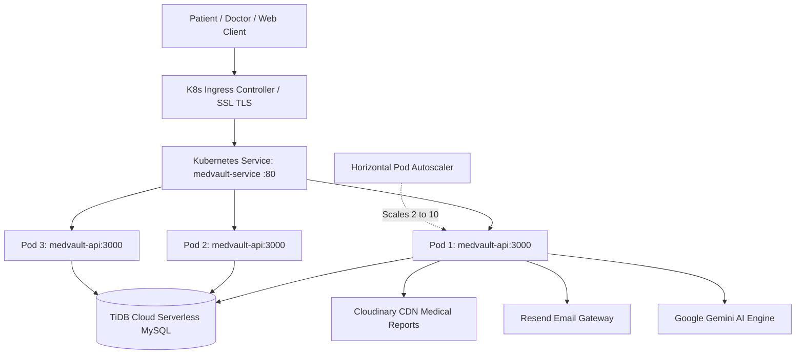

# ☸️ MedVault Kubernetes & Docker Production Architecture

This guide details how containerization with **Docker** and orchestration with **Kubernetes (K8s)** elevates the **MedVault Digital Health ID System** to enterprise healthcare grade standards.

---

## 🏥 1. Why Docker & Kubernetes for MedVault?

| Critical Healthcare Challenge | How Kubernetes & Docker Solves It |
| :--- | :--- |
| **Zero Downtime (24/7/365)** | In medical emergencies, system downtime can endanger lives. Rolling updates ensure new versions are deployed with **zero downtime**. Old pods stay active until new pods pass health checks. |
| **Self-Healing & Fault Tolerance** | If a pod crashes due to an unhandled exception or memory leak, Kubernetes automatically terminates it and spawns a fresh replica within seconds (`livenessProbe` & `restartPolicy`). |
| **Sudden Traffic Surges** | During epidemics, vaccination drives, or city-wide hospital spikes, the **Horizontal Pod Autoscaler (HPA)** automatically scales pods from 2 up to 10 based on CPU & Memory usage. |
| **HIPAA & Data Privacy Security** | Healthcare data is strictly isolated. All containers run as **non-root users** (`UID: 1000`). Database passwords and API keys are stored in encrypted **Kubernetes Secrets**, decoupled from code. |
| **Environment Consistency** | "It works on my machine" is eliminated. Docker bundles Node.js, libraries, security patches, and dependencies into an identical immutable image across development, staging, and production. |

---

## 🏛️ 2. Architecture Overview



---

## 🚀 3. Quickstart: Run Locally with Docker Compose

To test the entire stack with containerized networking:

```bash
# Build and launch all services in detached mode
docker-compose up -d --build

# View container status
docker-compose ps

# Check logs in real-time
docker-compose logs -f app

# Stop containers
docker-compose down
```

The system will be accessible on `http://localhost:3000`.

---

## ☸️ 4. Deploying to Kubernetes

### Prerequisites
- Docker & `kubectl` installed
- A running Kubernetes cluster:
  - **Local**: Enable Kubernetes in Docker Desktop settings, or run `minikube start`
  - **Cloud**: Google GKE, AWS EKS, or Azure AKS

### Step 1: Build the Docker Image
```bash
docker build -t medvault-api:latest .
```

*(If deploying to cloud GKE/EKS, tag and push to your container registry, e.g. `gcr.io/your-project/medvault-api:latest`)*

### Step 2: Automated Deployment

#### Windows PowerShell:
```powershell
.\k8s\deploy.ps1
```

#### Linux / macOS:
```bash
chmod +x ./k8s/deploy.sh
./k8s/deploy.sh
```

---

## 📋 5. Manifest Inventory (`k8s/`)

- [`k8s/namespace.yaml`](k8s/namespace.yaml): Creates isolated `medvault` namespace.
- [`k8s/configmap.yaml`](k8s/configmap.yaml): Non-sensitive configs (`DB_HOST`, `PORT`, `NODE_ENV`).
- [`k8s/secret.yaml`](k8s/secret.yaml): Sensitive credentials (`DB_PASSWORD`, `GEMINI_API_KEY`, `RESEND_API_KEY`, `JWT_SECRET`).
- [`k8s/deployment.yaml`](k8s/deployment.yaml): 3-replica production deployment with non-root security context, resource limits (requests: 100m CPU/128Mi RAM, limits: 500m CPU/512Mi RAM), and `/api/health` probes.
- [`k8s/service.yaml`](k8s/service.yaml): LoadBalancer service routing port 80 to container port 3000.
- [`k8s/hpa.yaml`](k8s/hpa.yaml): Horizontal Pod Autoscaler dynamically scaling between 2 and 10 pods.
- [`k8s/ingress.yaml`](k8s/ingress.yaml): NGINX Ingress rules with SSL/TLS redirection and CORS headers.

---

## 🔍 6. Cluster Verification & Troubleshooting

Check running pods:
```bash
kubectl get pods -n medvault -o wide
```

Inspect health probes and events:
```bash
kubectl describe pod -l app=medvault -n medvault
```

Stream live logs across all replicas:
```bash
kubectl logs -f -l app=medvault -n medvault --tail=50
```

Simulate scaling manually:
```bash
kubectl scale deployment medvault-api -n medvault --replicas=5
```
